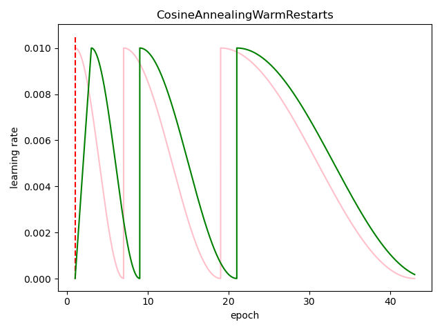
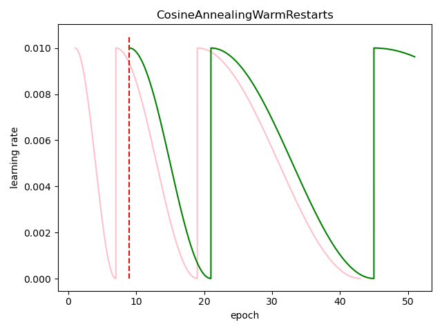

# WarmUpLR
WarmUp(学习率预热)、CosineAnnealingWarmRestarts(带重启的余弦退火模型)

### 目录：

* [1、学习率示意图](#1、学习率示意图)
* [2、CosineAnnealingWarmRestarts的使用](#2、CosineAnnealingWarmRestarts的使用)
* [3、WarmUp的使用](#3、WarmUp的使用)


## 1、学习率示意图

CosineAnnealingWarmRestarts、WarmUp+CosineAnnealingWarmRestarts的示意图为：

  

右图中的红线右边部分，其中绿色曲线是从第9个epoch重启之后的学习率，可以发现与左图一致！

## 2、CosineAnnealingWarmRestarts的使用

**先定义余弦周期性重启模型的基本参数：**

```python
param = {
    "eta_max": 0.01,
    "eta_min": 1e-5,
    "t0": 6,
    "ti": 2,
    "steps": 500,
}
```

`eta_max`与`eta_min`分别表示学习率的上下界；`t0`是基础的学习率重启周期，6表示基础周期为6个epochs；`ti`是周期的膨胀率；`steps`表示每个epoch的迭代次数。


**CosineAnnealingWarmRestarts实例化：**

```python
cosine = CosineAnnealingWarmRestarts(**param)
```


**获取某次迭代的学习率：**

```python
cosine.get_learning_rate(epoch, step_num)
```


注意这里的step_num可以不传，学习率的更新是渐进的，不能直接指定获取某epoch、某次迭代的学习率，只能从某个epoch第零次迭代开始获取。如果使用checkpoint，这需要对学习率进行epoch初始化：

```python
cosine.epoch_step_modify(epoch)
```


## 3、WarmUp的使用

**初始化原始学习率：**

```python
cosine2 = CosineAnnealingWarmRestarts(**param)
```


**使用checkpoint的epoch初始化：**

```python
cosine2.epoch_step_modify(epoch)
```


**初始化warm up学习率：**

```python
warm_up_lr = WarmUpLR(cosine, warm_epochs=2)
```


**获取某次迭代的学习率：**

```python'
warm_up_lr.get_learning_rate(epoch, step_num)
```


上述两者在训练中的调用参考test中的test_warmup_and_cosine.py文件。